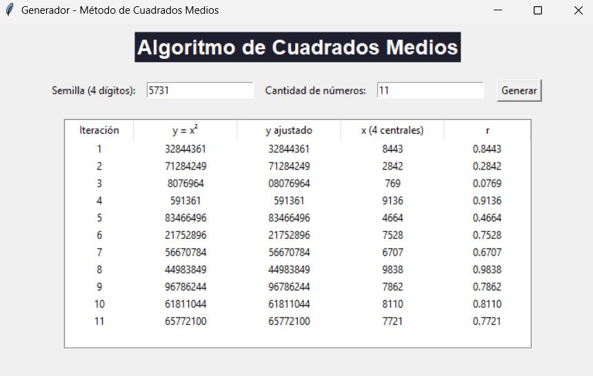

# Hilara Calle Cristian Ramiro

# ALGORITMO DE CUADRADOS MEDIOS
manejo: 1 ingresar la semilla 
        2 la cantidad de numeros
        3 hacer click en generar
observamos la corrida de un ejemplo realizado en clases
## Ejemplo de ejecución
Aquí una captura de pantalla del programa en funcionamiento:

