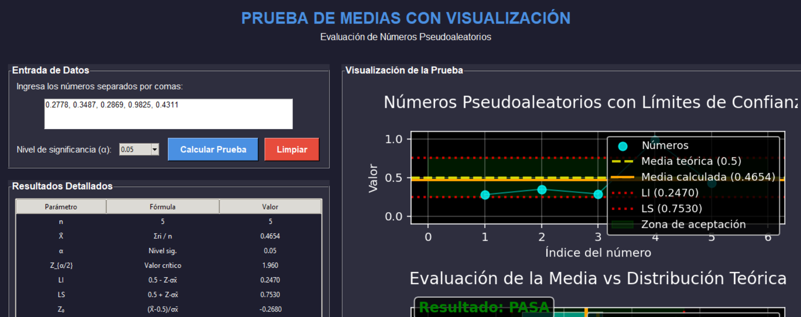
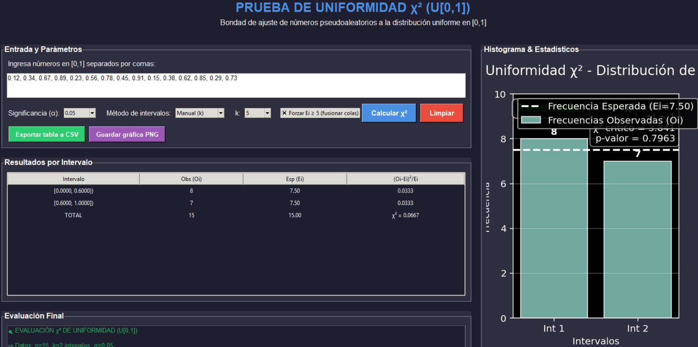

## Hilara Calle Cristian Ramiro
### Requisitos
- Python 3.7 o superior
- tkinter (incluido por defecto en Python)

### Librerías utilizadas
- `tkinter` - Para la interfaz gráfica
- `tkinter.ttk` - Para widgets con temas modernos  
- `tkinter.messagebox` - Para cuadros de diálogo
- `matplotlib` - Para generar gráficas y visualizaciones
- `matplotlib.backends.backend_tkagg` - Para integrar matplotlib con tkinter
- `numpy` - Para cálculos numéricos y manejo de arrays
- `scipy.stats` - Para la distribución Chi-cuadrado y cálculos estadísticos
- `math` - Para operaciones matemáticas básicas

### Instalación de dependencias
- pip install matplotlib numpy scipy

# ALGORITMO DE CUADRADOS MEDIOS
manejo: 
- 1 ingresar la semilla 
- 2 la cantidad de numeros
- 3 hacer click en generar
observamos la corrida de un ejemplo realizado en clases
### Ejemplo de ejecución
Aquí una captura de pantalla del programa en funcionamiento:

# ALGORITMO DE MULTIPLICADOR CONSTANTE
manejo: 
- 1 ingresar la semilla 
- 2 la cantidad de iteraciones n
- 3 hacer click en generar
observamos la corrida de un ejemplo realizado en clases
### Ejemplo de ejecución
Aquí una captura de pantalla del programa en funcionamiento:

# ALGORITMO DE MULTIPLICADOR CONSTANTE2
manejo: 
- 1 ingresar la semilla de 4 digitos
- 2 ingresar la constatante que igual es de cuatro digitos
- 3 luego la cantidad de iteraciones n
- 4 hacer click en generar
observamos la corrida de un ejemplo realizado en clases
### Ejemplo de ejecución
Aquí una captura de pantalla del programa en funcionamiento:

# PRUEBA DE MEDIAS
manejo: 
- 1 ingresar los numeros seaparados en comas 
- 2 elegir el valor de la significacia
- 3 hacer click en calcular prueba
observamos la corrida de un ejemplo realizado en clases
### Ejemplo de ejecución
Aquí una captura de pantalla del programa en funcionamiento con el grafico mostrando LS Y LI:

# PRUEBA DE VARIANZA
manejo: 
-1 ingresar los numeros seaparados en comas 
-2 elegir el valor de la significacia
-3 hacer click en calcular prueba
observamos la corrida de un ejemplo realizado en clases
### Ejemplo de ejecución
Aquí una captura de pantalla del programa en funcionamiento con el grafico mostrando LS Y LI::

# PRUEBA DE UNIFORMIDAD
manejo: 
- 1 ingresar los numeros seaparados en comas 
- 2 elegir el valor de la significacia
- 3 elegir el intervalo k
- 4 hacer click en calcular prueba
observamos la corrida de un ejemplo realizado en clases
### Ejemplo de ejecución
Aquí una captura de pantalla del programa en funcionamiento con el grafico mostrando LS Y LI::

# PRUEBA DE UNIFORMIDAD CHI-CUADRADO
manejo: 
- 1 ingresar los numeros seaparados en comas 
- 2 elegir el valor de la significacia
- 3 elegir el intervalo k
- 4 tambie te da elegir metodo de intervalo k
- 5 hacer click en calcular prueba
observamos la corrida de un ejemplo realizado en clases
## Ejemplo de ejecución
Aquí una captura de pantalla del programa en funcionamiento con el grafico mostrando LS Y LI::

